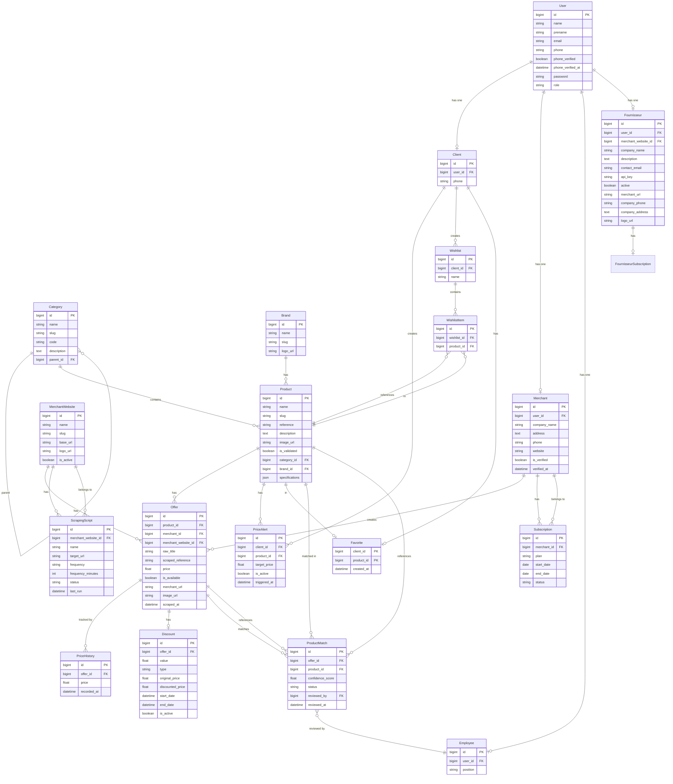

# PrixTunisix - Multi-Merchant Price Comparator

## Project Overview

**PrixTunisix** is a comprehensive price comparison platform for Tunisia that aggregates product prices from multiple e-commerce merchants into a unified catalog. The platform enables consumers to find the best deals across different online shops while providing merchants with a channel to showcase their products.

### Key Features

- **Multi-Merchant Aggregation**: Products and prices from multiple online stores
- **Smart Product Matching**: Automatic matching of similar products across different merchants
- **Price Alerts**: Users can set target prices and receive notifications
- **Favorites & Wishlists**: Save products for later comparison
- **AI-Powered Chatbot**: Natural language product search and recommendations
- **Supplier Portal**: Dedicated interface for merchants to manage their products
- **Admin Dashboard**: Complete system management and analytics

---

## Technology Stack

- **Framework**: Laravel 13 (PHP 8.3+)
- **Authentication**: Laravel Sanctum (API tokens)
- **Database**: MySQL/PostgreSQL
- **API Architecture**: RESTful JSON API
- **Testing**: Pest PHP
- **Code Quality**: Laravel Pint

---

## System Architecture

### User Roles

| Role | Description |
|------|-------------|
| **Guest** | Unauthenticated users who can browse products and search |
| **Client** | Registered users who can save favorites, create wishlists, set price alerts |
| **Merchant** | Business users who manage their offers and subscriptions |
| **Fournisseur** | Suppliers who provide product data via API |
| **Employee** | Internal staff who review product matches |
| **Admin** | System administrators with full control |

---

## Database Models (ER Diagram)



---

## API Endpoints

### Public Routes

#### Authentication
- `POST /api/auth/login` - User login
- `POST /api/auth/register` - User registration
- `POST /api/auth/otp/send` - Send OTP code
- `POST /api/auth/otp/verify-login` - Verify OTP for login
- `POST /api/auth/otp/verify-register` - Verify OTP for registration

#### Catalog
- `GET /api/categories` - List categories
- `GET /api/categories/{category}` - Category details
- `GET /api/brands` - List brands
- `GET /api/brands/{brand}` - Brand details
- `GET /api/products` - List products
- `GET /api/products/{product}` - Product details
- `GET /api/products/{product}/offers` - Product offers

#### Search
- `GET /api/search/suggestions` - Search suggestions
- `GET /api/search/results` - Search results
- `GET /api/search/filters` - Search filters

#### Fournisseur
- `POST /api/fournisseur/register` - Supplier registration
- `POST /api/fournisseur/login` - Supplier login
- `POST /api/fournisseur/track-click` - Track clicks (public)
- `POST /api/fournisseur/record-view` - Record product views (public)

### Authenticated Routes (Sanctum Token)

#### Client Features
- `POST /api/auth/logout` - Logout
- `GET /api/auth/me` - Current user info
- `PATCH /api/auth/profile` - Update profile
- `GET /api/client/dashboard` - Client dashboard with stats
- `POST /api/client/track-view` - Track product view

#### Wishlists
- `GET /api/client/wishlists` - List wishlists
- `POST /api/client/wishlists` - Create wishlist
- `DELETE /api/client/wishlists/{wishlist}` - Delete wishlist
- `POST /api/client/wishlists/{wishlist}/items` - Add item
- `DELETE /api/client/wishlists/{wishlist}/items/{item}` - Remove item

#### Price Alerts
- `GET /api/client/alerts` - List alerts
- `POST /api/client/alerts` - Create alert

#### Favorites
- `GET /api/favorites` - List favorites
- `POST /api/favorites` - Add favorite
- `POST /api/favorites/toggle` - Toggle favorite
- `DELETE /api/favorites/{productId}` - Remove favorite

#### Merchant Routes
- `GET /api/merchant/profile` - Merchant profile
- `PUT /api/merchant/profile` - Update profile
- `GET /api/merchant/offers` - List offers
- `POST /api/merchant/offers` - Create offer
- `PUT /api/merchant/offers/{offer}` - Update offer
- `DELETE /api/merchant/offers/{offer}` - Delete offer

#### Admin Routes
- `GET /api/admin/dashboard` - Dashboard stats
- `GET /api/admin/users` - List users
- `PUT /api/admin/users/{user}/role` - Update user role
- `GET /api/admin/fournisseurs` - List fournisseurs
- `PUT /api/admin/fournisseurs/{fournisseur}/toggle` - Toggle status
- `GET /api/admin/subscriptions` - List subscriptions
- `GET /api/admin/alerts` - List price alerts
- `GET /api/admin/product-matches` - Product matches list
- `PUT /api/admin/product-matches/{productMatch}` - Review match
- `GET /api/admin/analytics/clicks` - Click analytics

---

## Core Features

### 1. Product Catalog Management

- Hierarchical categories with parent/child relationships
- Brand management with logos
- Product validation workflow
- Product specifications (stored as JSON)

### 2. Price Comparison

- Multiple offers per product from different merchants
- Price history tracking
- Active discount display
- Lowest price calculation

### 3. Smart Matching

- Automatic product matching using confidence scoring
- Employee review workflow for matches
- Manual override capability

### 4. Client Features

- **Favorites**: Quick-save products (many-to-many)
- **Wishlists**: Organized saved products
- **Price Alerts**: Target price notifications
- **Product Views**: Track browsing history
- **AI Suggestions**: Personalized recommendations

### 5. Fournisseur Portal

- API key-based authentication
- Product submission
- Click/view tracking
- Subscription management
- Dashboard with analytics

### 6. Admin Functions

- User role management
- Merchant verification
- Content moderation (categories, brands, products)
- System analytics

---

## Services

### WhatsApp Service

Supports multiple providers for notifications:
- **log** (default for development)
- **twilio** - Twilio WhatsApp
- **ultramsg** - UltraMsg API (popular in Tunisia)

Configuration via `.env`:
```
WHATSAPP_PROVIDER=ultramsg
ULTRAMSG_INSTANCE=your_instance
ULTRAMSG_TOKEN=your_token
```

---

## Scheduled Commands

- `price:alerts` - Check and trigger price alerts
- `offers:match` - Match scraped offers to products

---

## Project Structure

```
backend/
├── app/
│   ├── Console/Commands/        # Artisan commands
│   ├── Http/
│   │   ├── Controllers/         # API controllers
│   │   ├── Middleware/          # Role middleware
│   │   └── Requests/            # Form requests
│   ├── Models/                  # Eloquent models
│   ├── Providers/               # Service providers
│   ├── Services/                # Business services
│   ├── Observers/               # Model observers
│   ├── Rules/                   # Validation rules
│   └── Support/                 # Helper classes
├── config/                      # Configuration files
├── database/
│   ├── migrations/              # Database migrations
│   ├── seeders/                 # Seed data
│   └── factories/               # Model factories
├── routes/                      # Route definitions
└── tests/                      # Test files
```

---

## Getting Started

### Installation

```bash
cd backend
composer install
cp .env.example .env
php artisan key:generate
php artisan migrate
php artisan serve
```

### Running Tests

```bash
composer test
```

### Code Quality

```bash
composer lint
```

---

## Security Features

- Password hashing (bcrypt)
- Phone verification via OTP
- Role-based access control
- API key authentication for suppliers
- Sanctum token-based API authentication

---

## License

MIT License